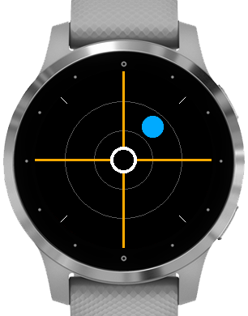
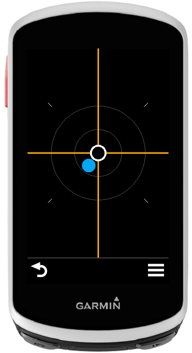
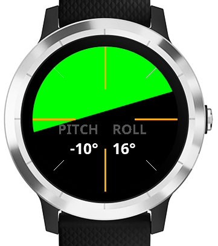

# Level

A `level` application for Garmin devices. Available on the Garmin Connect IQ store [here](https://apps.garmin.com/en-US/apps/9834ef13-f3dd-4997-9060-b0f4a42d72a7).

## Screenshots

## Description

**Level** turns your Garmin device into a standard level. When your device is held horizontally (lying flat on a table, for example), you're presented with a *bullseye* or *bubble*-style level. When your device is held vertically, you're presented with a horizon line that fills to show your pitch and roll.
